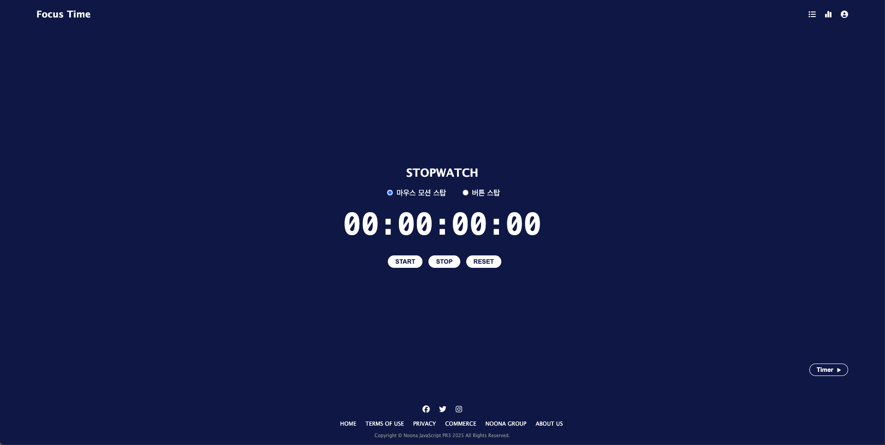

# ⏰ 디지털 디톡스 FOCUS TIME



## 📍 프로젝트 소개

> 코딩알려주는누나 바닐라 JS 프로젝트<br>
> 프로젝트명: FOCUS TIME<br>
> 프로젝트 기간: 2025.09.22 ~ 2025.09.28

현대인은 하루 평군 수 시간 이상을 스마트폰과 PC 앞에서 보냅니다.
이로 인해 지나친 디지털 기기 사용은 집중력 저하, 수면 부족, 업무 효율 저하 등 다양한 문제를 일으킵니다.

저희 팀은 이러한 문제를 해결하기 위해 **디지털 디톡스**라는 주제에 주목했습니다.
본 프로젝트는 단순한 일정 관리가 아니라, **타이머와 스톱워치, 투두리스트를 결합하여 사용자가 집중하고 휴식하는 패턴을 갖도록 돕는것**을 목표로 했습니다.

---

## 🗒️ 팀 페이지

[👉 팀 페이지 바로가기](https://www.notion.so/3-2757ec0bf68b80d78139df58a923e3b9)<br>
[👉 Figma](https://www.figma.com/design/YyIzuRmSY2iS2dzcPF4bAl/focus-time?node-id=0-1&t=CrHLqXgWMkKbRIfV-1)

## 🔗 배포 주소

[👉 FOCUS TIME 바로가기](https://js-focustime.netlify.app/)

## 👥 We are

<table>
  <tr>
    <td colspan="4" align="center" style="background-color:  padding: 15px; font-weight: bold; font-size: 20px; border-bottom: 2px solid #e1e4e8;">
      🚀 TEAM FOCUS TIME 🚀
    </td>
  </tr>
  <tr>
    <td align="center"><strong>황수곤</strong></td>
    <td align="center"><strong>허태웅</strong></td>
    <td align="center"><strong>장은영</strong></td>
    <td align="center"><strong>양원지</strong></td>
  </tr>

  <tr>
    <td align="center">
      <a href="https://github.com/sugonhwang" target="_blank" rel="noopener noreferrer">
        
      </a>
    </td>
    <td align="center">
      <a href="https://github.com/heotaewoong" target="_blank" rel="noopener noreferrer">
        
      </a>
    </td>
    <td align="center">
      <a href="https://github.com/skysas" target="_blank" rel="noopener noreferrer">
        
      </a>
    </td>
    <td align="center">
      <a href="https://github.com/wonjiyang" target="_blank" rel="noopener noreferrer">
        
      </a>
    </td>
  </tr>
  <tr>
    <td align="center"><strong>팀장 · PM</strong></td>
    <td align="center"><strong>팀원 · SM</strong></td>
    <td align="center"><strong>팀원 · PL</strong></td>
    <td align="center"><strong>팀원 · PL</strong></td>
  </tr>
  <tr>
    <td>
      <ul>
        <li>투두리스트</li>
        <li>프로젝트 관리</li>
        <li>기획 및 발표</li>
      <ul>
    </td>
    <td>
      <ul>
          <li>Dashboard 메인</li>
        <li>차트 랜더링</li>
        <li>API</li>
        <li>문서 작성</li>
      <ul>
    </td>
    <td>
      <ul>
         <li>로그인 화면</li>
        <li>회원가입</li>
        <li>디자인</li>
        <li>Intro 페이지</li>
        <li>Dashboard 서브</li>
      <ul>
    </td>
    <td>
      <ul>
        <li>스톱워치</li>
        <li>타이머</li>
        <li>Navigation</li>
        <li>Footer</li>
      <ul>
    </td>
  </tr>
</table>

## 💡 기획 구조도

### 🎯 프로젝트 컨셉

사용자가 주어진 시간을 온전히 집중할 수 있도록 스톱워치/타이머/투두리스트를 제공하며<br>
**주간/월간/연간 집중한 시간 및 완료한 할 일 등을 그래프로 보여줍니다.**

### 🔀 사용자 플로우

메인 페이지 → 로그인/회원가입 → 스톱워치/타이머 실행 → Todo List 등록 → 작업 이력 확인

---

## 💻 서비스 소개

### 🖥 메인 화면


- Intro 페이지입니다. 프로젝트 및 팀원들을 간단히 소개합니다.
- Start 버튼을 눌러 서비스를 이용할 수 있습니다.

---

### 🔐 로그인 & 회원가입


- 이름, 계정, 비밀번호을 입력하여 회원가입이 가능합니다.
- 비밀번호는 **영문자(대/소문자) + 숫자 8자리 이상**의 조합으로 설정하도록 유효성 검증을 합니다.
- 비밀번호 설정 시 설정된 비밀번호를 공개/비공개 할 수 있습니다.
- 가입 완료 시 모달창이 뜨면서 로그인에 성공합니다.

---

### ⏰ 스톱워치 & 타이머


- 로그인한 사용자는 스톱워치와 타이머를 사용할 수 있습니다.
  - 스톱워치: **마우스 모션**이 인식되면 시간을 멈출 수 있는 방법과 사용자기 직접 멈출 수 있는 방법 2가지로 구현했습니다.
  - 타이머: 기본적으로 30분이 설정되어 있으며 사용자는 **1분 단위**로 시간을 설정 할 수 있습니다.
- 두 기능을 사용할 경우 `Dashboard`에서 이력을 확인 할 수 있습니다.

---

### ✅ 투두 리스트


- 투두리스트 탭으로 이동하게 되면 현재 날짜로 자동 필터링 됩니다.
- 사용자는 날짜를 선택하여 투두리스트를 등록할 수 있으며 3개의 카테고리 선택이 가능합니다.
  - Work
  - Study
  - Hobby
- 투두리스트를 등록하면 리스트가 보이고 토글은 선택하여 완료 처리를 할 수 있습니다.
- 등록된 투두리스트 삭제 가능합니다.
- 등록한 투두리스트는 **localStorage**에 저장되어 페이지를 종료하더라도 로그인을 하면 등록한 날짜에 투두리스트가 보입니다.
- 투두리스트 이력은 `Dashboard`에서 활용됩니다.

---

### 📊 Dashboard

- 타이머, 스톱워치, 투두리스트 이력을 **주간/월간/연간** 으로 확인 할 수 있습니다.
- **목표 달성 시간, 전체 집중한 시간, 프로젝트 시간 비율을 그래프로 그려줍니다.**

---

### 📌 향후 개선 계획

- 모바일 성능 개선
- 접근성 강화
  - Label 없는 Input 수정
  - aria-label 없는 아이콘 버튼 수정
- 투두리스트 알람 기능
- 플레이 리스트 API 기능 사용
- 스타일 개선

---

## 🛠 기술 스택

|      <div align="left">분류</div>      | <div align="left">도구</div>                                                                                                                                                                                                           |
| :------------------------------------: | -------------------------------------------------------------------------------------------------------------------------------------------------------------------------------------------------------------------------------------- |
|   <div align="left">개발 언어</div>    |   |
| <div align="left">Design / Style</div> |                                                                                                                                      |
|   <div align="left">협업 도구</div>    |                     |
|   <div align="left">버전 관리</div>    |                                                                                                                                |
|      <div align="left">IDE</div>       |                                                                                                                                            |
|      <div align="left">배포</div>      |                                                                                                                       |

## 📂 프로젝트 구조 및 기타

```
📁 focus-time
├── 📁 .github
├── 📁 assets
├── ├── 📁 alarms
├── ├── 📁 fonts
├── ├── 📁 images
├── 🗂️ history              // 대시보드
├── ├── ⚡ app.js
├── ├── 🌐 index.html
├── ├── 🎨 style.css
├── 🔑 login                // 로그인
├── ├── ⚡ Login.js
├── ├── 🌐 Login.html
├── ├── 🎨 Login.css
├── 📝 register             // 회원 가입
├── ├── ⚡ Register.js
├── ├── 🌐 Register.html
├── ├── 🎨 Register.css
├── ⏱️ stopwatch            // 스탑 워치
├── ├── ⚡ StopWatch.js
├── ├── 🌐 StopWatch.html
├── ├── 🎨 StopWatch.css
├── ⏰ timer                // 타이머
├── ├── ⚡ Timer.js
├── ├── 🌐 Timer.html
├── ├── 🎨 Timer.css
├── 📒 todolist             // 투두리스트
├── ├── ⚡ TodoList.js
├── ├── 🌐 TodoList.html
├── ├── 🎨 TodoList.css
├── 📒 index.html           // 인트로 페이지
```
